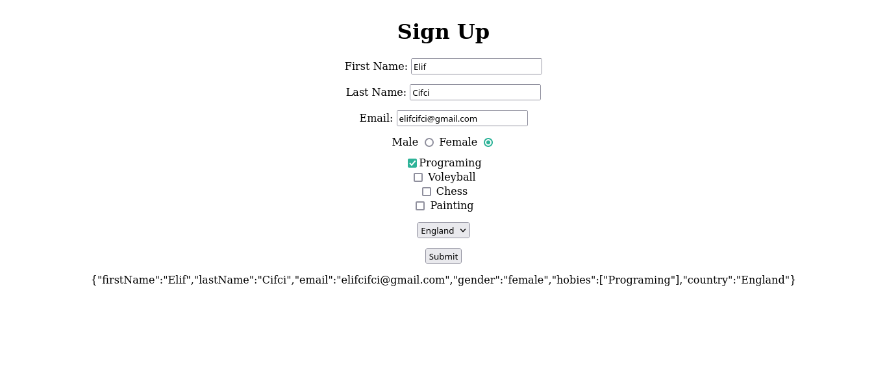
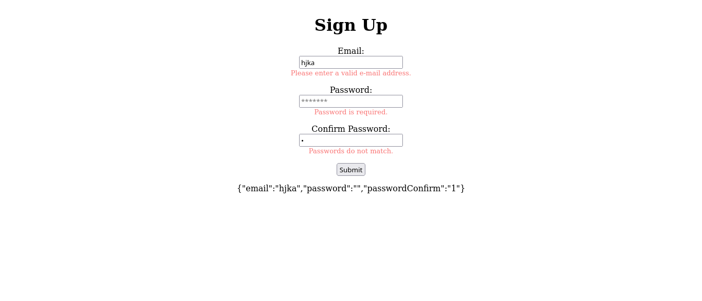

# Formik Exercises

### Exercised with this project: 
- Used handleSubmit and handleChange,
- Created radio, checkboxes, and dropdown,
- Used useFormik,
- Made validation.

### In the project directory, you can run:
- `npm start`

### View of exercises:

