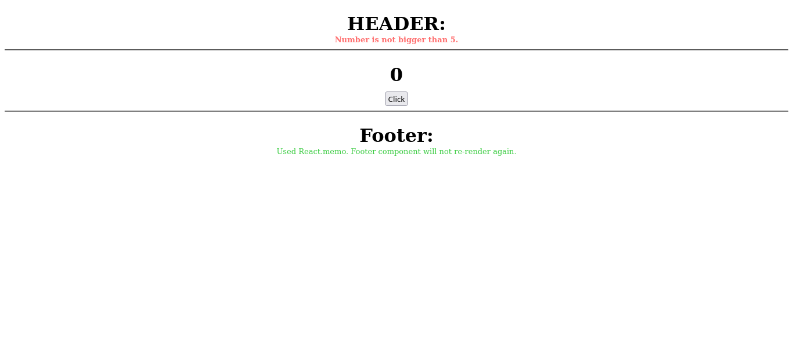

# Memoization Exercises

### Exercised with this project: 
- React.memo,
- useMemo,
- useCallback.

### In the project directory, you can run:
- `npm start`

### View of exercises:

 Exercised with React.memo: Unnecessary rendering is avoided.

------

Exercised with useMemo: Header component was not affected by input changes.

------

Exercised with useCallback: Header component was not affected by click event.
